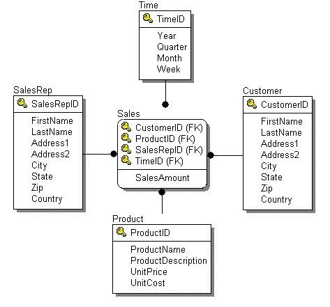

**To Setup:**
- Start mysql server, initialize database with [schema.sql](schema.sql) and [data.sql](data.sql)
- Start glassfish server:  `${path to glassfish4}/bin/asadmin start-domain domain1`
- Create database on mysql server and setup proper jdbc connection on glassfish

    Example of properties for creating a connection pool:  

        serverName   : localhost
        port         : 3306
        databaseName : wsa500_sales
        user         : wsa500_sales
        password     : salesPassword
- Create JDBC Resource for referencing connection pool with name `jdbc/wsa500_sales`
- Build, archieve project, deploy onto glassfish server  
  
    
    
Below are original instruction for completing the assignment:
====

**Sales system (20 % of the total mark)**

**SalesRep Table:**

    SalesRepID: Primary Key integer

    FirstName: 30 characters (alpha numeric)

    LastName: 30 characters (alpha numeric)

    Address1: 40 characters (alpha numeric)

    Address2: 40 characters (alpha numeric)

    City: 20 characters (alpha)

    State: 20 characters (alpha)

    Zip: 10 characters (alpha numeric)

    Country : 10 characters (alpha)

**Time Table:**

    TimeID: Primary Key integer

    Year: 4 characters (integer numeric)

    Quarter: 1 characters (integer numeric)

    Month: 2 characters (integer numeric)

    Week: 1 characters (integer numeric)

**Product Table:**

    ProductID: Primary Key integer

    ProductName: 40 characters (alpha numeric)

    ProductDescription: 40 characters (alpha numeric)

    UnitPrice: 10.2 Decimal

    UnitCost:10.2 Decimal;

**Customer Table:**

    CustomerID: Primary Key integer

    FirstName: 30 characters (alpha numeric)

    LastName: 30 characters (alpha numeric)

    Address1: 40 characters (alpha numeric)

    Address2: 40 characters (alpha numeric)

    City: 20 characters (alpha)

    State: 20 characters (alpha)

    Zip: 10 characters (alpha numeric)

    Country : 10 characters (alpha)

**Sales Table:**

Does not have primary key, and no specific information other than the
SalesAmount that should be decimal (10.2).

Do the following

1.  Create the tables (2 marks)

2.  Design the xml schema (XSD) to represent this system (6 marks)

3.  Web service with methods

    a.  To LIST customer sales ( request parameter by customer last
        name) including product, time and sales rep (4 Marks)

    b.  LIST of **products** by request parameter (2 Marks)

        i.  Unit price, or

        ii. Unit cost

    c.  Insert customer (2 Marks)

    d.  Update customer (2 marks)

    e.  Insert product (2 marks)
